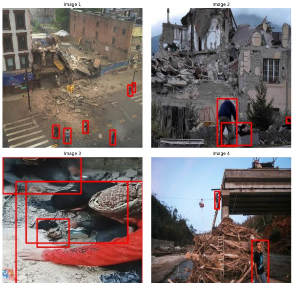
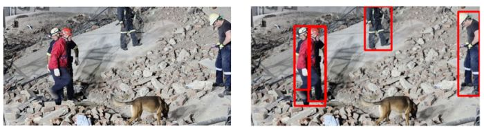

# Enhanced Search and Rescue Operation using Faster RCNN
Enhancing Search and Rescue Operations in Post-Disaster Environments Using Faster R-CNN



### Overview

<p align="justify">Natural disasters such as earthquakes, hurricanes, and floods can cause significant damage to infrastructure and result in the loss of human lives. In such situations, search and rescue operations are critical to saving lives and providing aid to those in need. In this project, I implemented an enhanced search and rescue system that uses a Faster R-CNN model to detect trapped humans in post-disaster environments. The system can help first responders quickly identify and locate survivors, hazards, and other critical objects, improving the efficiency and effectiveness of search and rescue operations.</p>


### Model

<p align="justify">The model I used was a pre-trained Faster R-CNN model with a ResNet-50 backbone. I fine-tuned the model on a custom dataset of images containing humans commonly found in post-disaster environments. The model checkpoint can be downloaded in this repository.</p>

### Inference

A simple Streamlit interface has been provided in case you want to test the model on your own images. 

### References

```
@article{song2023pdd,
  title={PDD: post-disaster dataset for human detection and performance evaluation},
  author={Song, Haoqian and Song, Weiwei and Cheng, Long and Wei, Yue and Cui, Jinqiang},
  journal={IEEE Transactions on Instrumentation and Measurement},
  year={2023},
  volume={73},
  articlenumber={5501214},
  pages={1--14},
  month={Dec.},
  publisher={IEEE}
}
```



<a href="https://media-cache.primedia-service.com/media/hwbb0m0r/whatsapp-image-2024-05-07-at-001150.jpeg?width=1200&height=630" target="_blank">Image Source</a>
